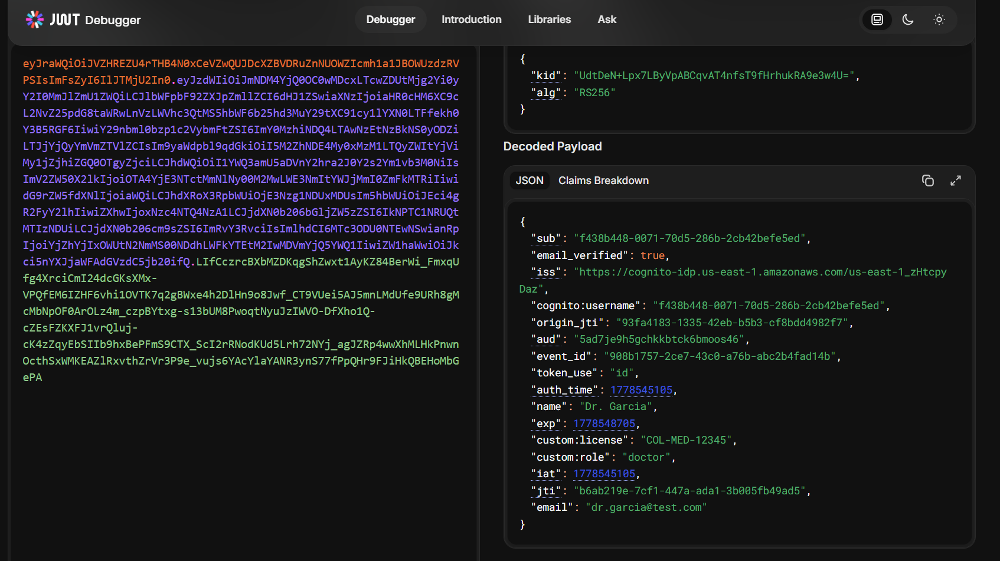
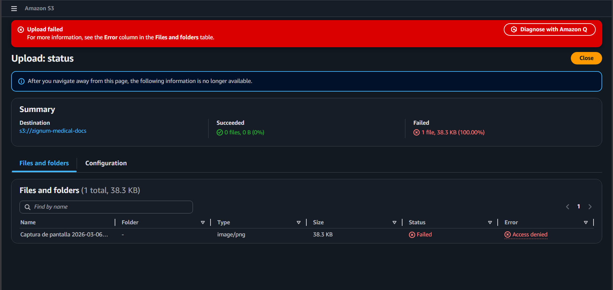

# Zignum


Plataforma de telemedicina serverless con videoconferencia y gestión de expedientes clínicos. Construida sobre AWS con aislamiento de red completo, cifrado en tránsito y reposo, y control de acceso basado en roles a nivel de token JWT.

Nota: los despliegues de Lambda en main se ejecutan via GitHub Actions.

---

## Stack

| Capa | Tecnología |
|------|-----------|
| Frontend | React + Vite (SPA) alojado en S3 |
| Auth | AWS Cognito (2 User Pools independientes) + Lambda Authorizer |
| API | API Gateway REST + JWT custom claims |
| Cómputo | AWS Lambda — Python 3.14 |
| Base de datos | RDS PostgreSQL en subred privada (VPC) |
| Almacenamiento | S3 con SSE-KMS (CMK gestionada por el cliente) |
| CDN | CloudFront con dos cache behaviors diferenciados |
| Secretos | GitHub Encrypted Secrets → variables de entorno Lambda |
| CI/CD | GitHub Actions — deploy por diff de carpeta |

---

## Arquitectura

```
                              ┌─────────────────────┐
                              │   Cognito            │
             ┌────────────────┤  Pool A — Médicos    │
             │   JWT          │  Pool B — Pacientes  │
             │  (custom       └──────────┬───────────┘
             │   claims)                 │ Pre Token
             │                          │ Generation
             ▼                          ▼  Lambda Trigger
    ┌────────────────┐       custom:role / custom:license
    │   CloudFront   │       inyectados antes de firmar
    │                │
    │  /* → S3       │       ┌──────────────────────────┐
    │  /api/* → APIGW│──────►│      API Gateway         │
    │                │       │   Lambda Authorizer       │
    │  Geo: CO,MX,AR │       │   valida JWT + genera     │
    │  WAF: OWASP    │       │   IAM Policy por rol      │
    └────────────────┘       └──────────┬───────────────┘
                                        │
                    ┌───────────────────┼───────────────────┐
                    ▼                   ▼                   ▼
             ┌────────────┐    ┌──────────────┐    ┌──────────────┐
             │  λ docs    │    │  λ records   │    │  λ authorizer│
             │            │    │              │    │              │
             │ presigned  │    │  CRUD        │    │ JWKS verify  │
             │ URL logic  │    │  expedientes │    │ policy gen   │
             └──────┬─────┘    └──────┬───────┘    └──────────────┘
                    │                 │
          ┌─────────▼─────────────────▼──────────┐
          │              VPC Privada              │
          │                                      │
          │   ┌───────────┐    ┌──────────────┐  │
          │   │    S3     │    │ RDS Postgres │  │
          │   │ SSE-KMS   │    │  subred      │  │
          │   │ (CMK)     │    │  privada     │  │
          │   └─────┬─────┘    └──────────────┘  │
          │         │                             │
          │   ┌─────▼──────┐                      │
          │   │  KMS CMK   │                      │
          │   │  solo λ    │                      │
          │   │  docs      │                      │
          │   └────────────┘                      │
          └───────────────────────────────────────┘
```

### Decisiones de diseño relevantes

**Dos User Pools separados en Cognito.** La alternativa era un pool único con grupos. Se eligieron pools separados porque los atributos custom difieren entre roles (`custom:license` para médicos, `custom:national_id` para pacientes) y el modelo de validación de cada rol es distinto. La desventaja es gestionar dos conjuntos de App Clients; es un trade-off aceptable para el nivel de aislamiento que requiere el dominio médico.

**Pre Token Generation Lambda Trigger en lugar de claims estáticos.** Los custom claims se inyectan dinámicamente desde RDS antes de que Cognito firme el JWT. Esto permite revocar permisos en tiempo real (un médico con licencia suspendida recibe `custom:license_active: false` en su siguiente login sin necesidad de invalidar tokens existentes).

**CMK de KMS con deny explícito por Principal.** La Key Policy deniega `kms:Decrypt` y `kms:GenerateDataKey` a cualquier principal que no sea `ZignumLambdaDocsRole`, incluyendo el rol de administrador de la consola. Esto hace que la restricción sea demostrable: un intento de descarga directa desde la consola S3 retorna `AccessDenied` desde KMS, no desde S3. Ver evidencia en [`docs/images/Access-Denied.png`](docs/images/Access-Denied.png).

**VPC Endpoints en lugar de NAT Gateway.** Las Lambdas en VPC acceden a S3 vía Gateway Endpoint (gratis) y a KMS vía Interface Endpoint. Esto elimina el costo del NAT Gateway (~$32/mes) y el tráfico hacia esos servicios nunca sale de la red de AWS.

**GitHub Secrets en lugar de AWS Secrets Manager.** Secrets Manager cuesta $0.40/secreto/mes — no es Free Tier. Las credenciales de RDS se almacenan como GitHub Encrypted Secrets y el CI/CD las inyecta como variables de entorno en cada Lambda al momento del deploy mediante `update-function-configuration`. Las variables de entorno en Lambda están cifradas en reposo por AWS con la clave KMS del servicio. El trade-off frente a Secrets Manager es que no hay rotación automática de credenciales ni auditoría de acceso granular; para un entorno de producción real se usaría Secrets Manager.

**Presigned URLs con duración según tipo de documento.** Las URLs para imágenes diagnósticas expiran en 5 minutos (datos altamente sensibles, uso puntual). Los informes PDF expiran en 1 hora (el médico puede necesitar tiempo para revisarlos). La Lambda valida que el `sub` del JWT coincide con el `patient_id` en RDS antes de generar la URL — un paciente no puede solicitar URLs de documentos de otro paciente aunque conozca el ID.

---

## Estructura del repositorio

```
zignum/
├── .github/
│   └── workflows/
│       ├── deploy-lambdas.yml      # Deploy por diff + inyección de env vars desde GitHub Secrets
│       ├── deploy-frontend.yml     # Build + S3 sync + invalidación CloudFront
│       ├── pr-checks.yml           # Lint, validación de estructura, escaneo de secretos
│       ├── start-dev.yml           # Enciende RDS + reactiva concurrencia de Lambdas
│       ├── teardown.yml            # Apaga RDS + suspende Lambdas (con confirmación)
│       └── cost-check.yml          # Reporte semanal de costos vía Cost Explorer API
│
├── lambdas/
│   ├── authorizer/                 # Lambda Authorizer — valida JWT Cognito, emite IAM Policy
│   ├── docs/                       # Presigned URLs — upload/download con validación de ownership
│   ├── records/                    # CRUD expedientes médicos en RDS
│   ├── pre-token-doctors/          # Cognito trigger — inyecta claims médicos al JWT
│   └── pre-token-patients/         # Cognito trigger — inyecta claims pacientes al JWT
│
├── infra/
│   ├── vpc/
│   ├── rds/
│   ├── kms/
│   ├── s3/
│   ├── cognito/
│   ├── api-gateway/
│   └── cloudfront/
│
├── frontend/
│
├── docs/
│   ├── images/
│   └── decisions/
│       ├── ADR-001-kms-policy.md
│       ├── ADR-002-dual-user-pools.md
│       └── ADR-003-presigned-url-expiry.md
│
└── scripts/
    ├── create-tables.sql
    ├── seed-test-data.sh
    └── cleanup.sh
```

---

## Setup

### Requisitos

- AWS CLI v2 configurado con un usuario IAM (no root)
- Python 3.14
- Node.js 20+ (Requerido para compilar Vite/React)
- Cuenta AWS con Free Tier activo

### Desarrollo Local (Frontend)

Para correr la interfaz de usuario en tu máquina:

```bash
cd frontend
npm install
npm run dev
```

Esto levantará el servidor de Vite en modo de desarrollo. Las variables de entorno para conectarse con AWS deben configurarse copiando `.env.example` a `.env.local` (este archivo no se sube a Git).

### GitHub Secrets requeridos

Configura estos secrets en `Settings → Secrets and variables → Actions` antes de cualquier deploy:

```
# Credenciales AWS
AWS_ACCESS_KEY_ID
AWS_SECRET_ACCESS_KEY
AWS_REGION                        # us-east-1

# RDS — conexión directa (sin Secrets Manager, Free Tier)
DB_HOST                           # endpoint de RDS, no cambia al detener/iniciar
DB_NAME                           # zignum
DB_USER                           # admin
DB_PASSWORD                       # contraseña master de RDS

# Recursos AWS
DOCS_BUCKET                       # zignum-medical-docs-{ACCOUNT_ID}
FRONTEND_BUCKET                   # zignum-frontend-{ACCOUNT_ID}
KMS_KEY_ARN                       # ARN de la CMK

# Cognito
COGNITO_DOCTORS_POOL_ID
COGNITO_DOCTORS_CLIENT_ID
COGNITO_PATIENTS_POOL_ID
COGNITO_PATIENTS_CLIENT_ID

# API y CDN
API_GATEWAY_URL
CLOUDFRONT_URL
CLOUDFRONT_DISTRIBUTION_ID
```

### Cómo funciona la inyección de credenciales

El workflow `deploy-lambdas.yml` ejecuta dos pasos por cada Lambda que necesita base de datos:

1. `update-function-code` — sube el ZIP con el código Python
2. `update-function-configuration` — actualiza las variables de entorno con los valores de GitHub Secrets

```
GitHub Secrets (cifrados) → Actions runner (en memoria) → Lambda env vars (cifrados en reposo)
```

Las variables de entorno en Lambda están cifradas en reposo por AWS usando la clave KMS del servicio Lambda. `DB_PASSWORD` nunca aparece en texto plano en los logs de Actions (GitHub enmascara automáticamente los valores de Secrets).

En el código Python de cada Lambda, la conexión a RDS se hace con:

```python
import os, psycopg2

connection = psycopg2.connect(
    host=os.environ['DB_HOST'],
    user=os.environ['DB_USER'],
    password=os.environ['DB_PASSWORD'],
    dbname=os.environ['DB_NAME'],
    port=int(os.environ.get('DB_PORT', 5432)),
    connect_timeout=5
)
```

---

## CI/CD

### Deploy de Lambdas

El workflow `deploy-lambdas.yml` detecta qué carpetas dentro de `lambdas/` cambiaron usando `dorny/paths-filter` y solo despliega las funciones afectadas.

```
push a main con cambios en lambdas/docs/
    │
    ├── detect-changes → docs: true, records: false, ...
    │
    └── deploy-docs
            ├── build + zip
            ├── update-function-code    → sube el nuevo código
            ├── wait function-updated
            ├── update-function-configuration → inyecta env vars desde GitHub Secrets
            └── wait function-updated
```

Los checks del PR bloquean el merge si:
- Hay errores de sintaxis o estilo (flake8, max-line-length 100)
- Falta `handler.py` o `requirements.txt` en alguna Lambda
- Las dependencias no son instalables en Python 3.14
- Se detectan patrones de Access Keys o passwords hardcodeados en el código

### Gestión del entorno (Free Tier)

```bash
# Desde GitHub Actions → workflow_dispatch:
# "Apagar entorno"   → detiene RDS + concurrencia Lambdas a 0
# "Encender entorno" → inicia RDS + restaura concurrencia

# Desde terminal:
aws rds stop-db-instance  --db-instance-identifier zignum-db
aws rds start-db-instance --db-instance-identifier zignum-db
```

RDS se reinicia automáticamente a los 7 días si está detenida. El `cost-check.yml` corre cada lunes y avisa si hay recursos con costo activo.

---

## Seguridad

### IAM — Mínimo privilegio por función

Cada Lambda tiene su propio rol IAM con permisos específicos:

| Rol | Permisos |
|-----|---------|
| `ZignumLambdaDocsRole` | `s3:GetObject`, `s3:PutObject` en el bucket de docs; `kms:GenerateDataKey`, `kms:Decrypt` en la CMK; VPC networking |
| `ZignumLambdaRecordsRole` | VPC networking únicamente (RDS via env vars) |
| `ZignumLambdaAuthorizerRole` | Solo `logs:CreateLogGroup`, `logs:PutLogEvents` |
| `ZignumLambdaPreTokenRole` | VPC networking (RDS via env vars) |

### KMS Key Policy

La CMK tiene tres statements:

1. **Root account** — administración de la clave (recuperación de emergencia).
2. **`ZignumLambdaDocsRole`** — único principal autorizado para `GenerateDataKey` y `Decrypt`.
3. **Deny explícito** — cualquier otro principal que intente `Decrypt` o `GenerateDataKey` recibe denegación, incluyendo el rol de administrador de la consola. Este Deny toma precedencia sobre cualquier política IAM adjunta al principal.

Ver demostración del deny en [`docs/images/Access-Denied.png`](docs/images/Access-Denied.png).

### Cognito — Custom claims en el JWT

```json
{
  "sub": "a1b2c3d4-...",
  "email": "dr.garcia@zignum.co",
  "custom:role": "doctor",
  "custom:license": "COL-MED-12345",
  "custom:license_active": "true",
  "iss": "https://cognito-idp.us-east-1.amazonaws.com/us-east-1_XXXXX",
  "exp": 1234567890
}
```

El Lambda Authorizer verifica la firma contra la JWKS pública del User Pool, extrae `custom:role`, y genera una IAM Policy que restringe los endpoints accesibles. El `sub` se pasa en el contexto del Authorizer para que los Lambdas de backend validen ownership sin re-decodificar el token.

---

## Costos estimados (Free Tier)

| Servicio | Free Tier | Costo fuera de Free Tier |
|----------|-----------|--------------------------|
| Lambda | 1M invocaciones/mes | $0.20 por millón |
| API Gateway | 1M llamadas/mes (12 meses) | $3.50 por millón |
| RDS db.t3.micro | 750 horas/mes (12 meses) | ~$15/mes |
| S3 | 5 GB / 20K GETs / 2K PUTs | Marginal |
| CloudFront | 1 TB transfer / 10M requests | Marginal |
| Cognito | 50,000 MAU | $0.0055 por MAU adicional |
| KMS CMK | — | **$1/mes fijo por clave** |
| ~~Secrets Manager~~ | ~~No Free Tier~~ | **No usado** |

**Total estimado durante desarrollo: ~$1/mes** (solo la CMK de KMS, asumiendo Free Tier activo y RDS apagada cuando no se usa). Al finalizar el proyecto, ejecutar `scripts/cleanup.sh` para eliminar la CMK y detener todos los recursos.

---

## Schema de base de datos

```sql
patients    (id, cognito_sub, email, full_name, date_of_birth, national_id)
doctors     (id, cognito_sub, email, full_name, license_number, specialty, verified)
documents   (id, patient_id, doctor_id, s3_key, doc_type, file_name, file_size, mime_type)
audit_log   (id, action, user_sub, document_id, ip_address, timestamp)
```

`cognito_sub` es la FK entre RDS y el User Pool de Cognito. El campo `doc_type` (ENUM: `diagnostic_image`, `report`, `lab_result`) determina la expiración de las presigned URLs. Script completo en [`scripts/create-tables.sql`](scripts/create-tables.sql).

---

## Evidencias del proyecto

| Requisito | Evidencia |
|-----------|-----------|
| JWT con custom claims | <a href="docs/images/jwt-claims-demo.png"></a> |
| KMS deny desde consola | <a href="docs/images/Access-Denied.png"></a> |
| CloudFront behaviors | *(Pendiente: Agregar docs/images/cloudfront-behaviors.png)* |
| CloudWatch dashboard | *(Pendiente: Agregar docs/images/cloudwatch-dashboard.png)* |
| Restricción geográfica | *(Pendiente: Agregar docs/images/geo-restriction.png)* |

---

## Autores

Desarrollado como proyecto final de Cloud Computing.

---

*Las capturas de pantalla referenciadas deben agregarse a `docs/images/` durante la implementación.*